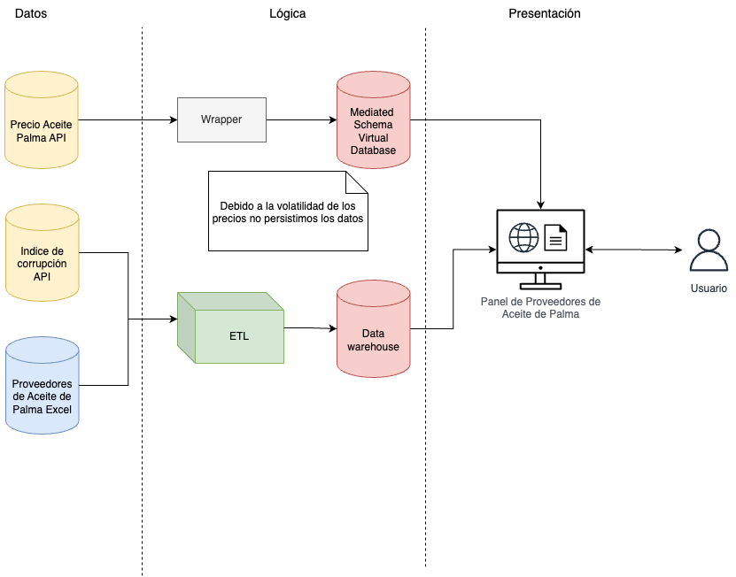

# Análisis y control de los productos de aceite de palma

## Introducción

La solución propuesto implementará un sistema para facilitar la evaluación de proveedores de commodities, específicamente centrado en el **aceite de palma**. Este sistema combina información de múltiples fuentes através de APIs y hojas de cálculo con datos de proveedores. Los datos son almacenados en un *Data Warehouse*, mientras que los precios del aceite de palma son consultados en tiempo real dada su volatilidad. Los datos se visualizan a través de un panel intuitivo, ofreciendo a los usuarios acceso dinámico y consolidado a indicadores críticos para la toma de decisiones estratégicas, asegurando sostenibilidad, transparencia y competitividad en la cadena de suministro.

## Arquitectura

En la Capa de Lógica, los datos son gestionados mediante un proceso ETL (Extract, Transform, Load) para almacenamiento en un Data Warehouse, mientras que un esquema mediado permite consultas en tiempo real sin almacenamiento persistente. En la Capa de Presentación, los datos se visualizan a través de un panel intuitivo:




## Primeros pasos

```
# Technical prerequisites

# Ubuntu or Debian
sudo apt update
sudo apt install podman

# Fedora
sudo dnf install podman

# MacOS
brew install podman

# Install Podman Compose
sudo pip3 install podman-compose

# Test installation
podman-compose --version

# End Technical prerequisites

# Run the application
podman-compose up

# Test application running
podman ps

# Shutdown the application
podman-compose up

```
## Equipo

* Nuria González Hernández
* Raquel Cristina Castro Núñez
* Jorge Ramos Santana
* Jorge Blanco Gómez
* Carlos Ignacio Salinas Gancedo

